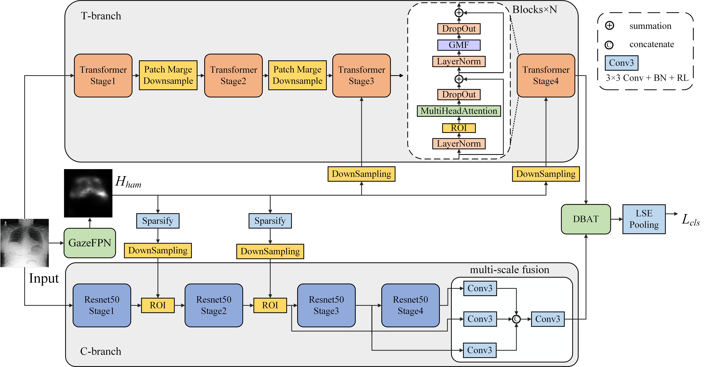
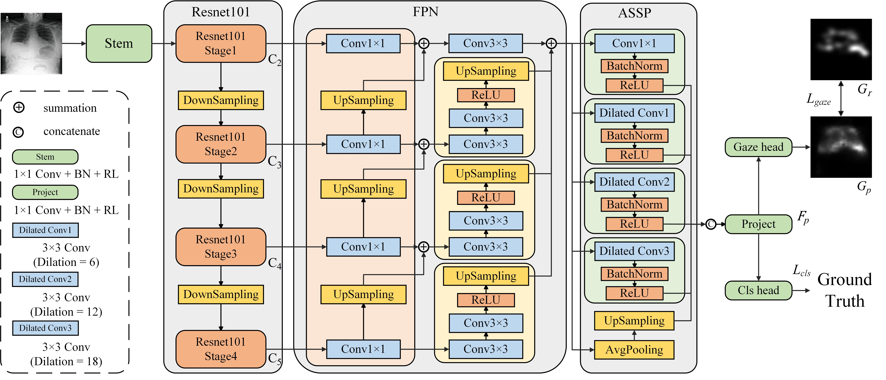

# SGHF

This repository provides a basic implementation of the paper:

**Towards Clinician-Like Reasoning: Stage-Aware Gaze-Guided Heterogeneous Network for Medical Image Recognition**

SGHF is a stage-aware gaze-guided heterogeneous CNN--Transformer framework for medical image recognition. The method first trains GazeFPN to generate gaze maps from eye-tracking datasets, and then uses the generated gaze priors to guide the downstream SGHF classification model.

## Overview

The whole pipeline contains two stages:

* **Stage 1: GazeFPN training**
  GazeFPN is trained on eye-tracking datasets to predict human gaze maps.

* **Stage 2: SGHF training**
  The pretrained GazeFPN is used to generate gaze priors for the SGHF model. SGHF combines a CNN branch and a Transformer branch, and uses GMF and DBAT modules for global modeling and local--global feature fusion.

## Architecture

### Framework overview of SGHF



### Architecture of GazeFPN



## Repository Structure

```text
SGHF/
├── stage1_gazefpn/
│   ├── models/
│   ├── cxr_gaze/
│   └── gi_gaze/
│
├── stage2_sghf/
│   ├── models/
│   ├── chestxray14/
│   ├── rad/
│   └── kvasir_v2/
│
├── assets/
└── requirements.txt
```

## Datasets

Please download the datasets from their official sources and modify the dataset paths in the corresponding `train.py` or `test.py` files.

| Dataset                | Usage                          | Link                                                                                   |
| ---------------------- | ------------------------------ | -------------------------------------------------------------------------------------- |
| REFLACX                | CXR gaze prediction            | https://doi.org/10.13026/e0dj-8498                                                     |
| ChestX-ray14           | CXR multi-label classification | https://niHVTHNet.app.box.com/v/ChestXray-NIHVTHNET                                    |
| RAD                    | CXR multi-class classification | https://www.kaggle.com/datasets/tawsifurrahman/covid19-radiography-database            |
| Colorectal Polyps Gaze | GI gaze prediction             | https://zenodo.org/records/13824600                                                    |
| Kvasir-V2              | GI multi-class classification  | https://www.kaggle.com/datasets/plhalvorsen/kvasir-v2-a-gastrointestinal-tract-dataset |

## Requirements

The code was tested with the following environment:

Python 3.10 PyTorch 2.3.1 CUDA 12.1

A basic environment can be prepared with:

```bash
pip install -r requirements.txt
```

Commonly used packages include:

```text
torch
torchvision
numpy
opencv-python
Pillow
scikit-learn
matplotlib
tqdm
```

## Training

### Stage 1: Train GazeFPN

For chest X-ray gaze prediction:

```bash
cd stage1_gazefpn/cxr_gaze
python train.py
```

For gastrointestinal gaze prediction:

```bash
cd stage1_gazefpn/gi_gaze
python train.py
```

Before training, please modify the dataset paths and checkpoint saving paths in the corresponding files.

### Stage 2: Train SGHF

For ChestX-ray14:

```bash
cd stage2_sghf/chestxray14
python train.py
```

For RAD:

```bash
cd stage2_sghf/rad
python train.py
```

For Kvasir-V2:

```bash
cd stage2_sghf/kvasir_v2
python train.py
```

Please specify the path of the pretrained GazeFPN checkpoint before training SGHF.

## Evaluation

Each dataset folder contains its own testing or evaluation file. For example:

```bash
python test.py
```

The reported metrics include AUC, accuracy, precision, recall, and F1-score, depending on the corresponding task setting.

## Notes

This repository is organized according to the original two-stage experimental pipeline. Dataset-specific training files are kept separately to preserve the original experimental settings.

Pretrained weights are available upon request.

## Citation

```bibtex
@article{liu2026sghf,
  title={Towards clinician-like reasoning: Stage-aware gaze-guided heterogeneous network for medical image recognition},
  author={Liu, Boyang and Li, Guangli and Zou, Yuxing and Zhang, Ruiyang and Zhou, Xinjiong and Zhang, Hongbin and Lv, Jingqin and Luo, Gongning and Ji, Donghong},
  journal={Displays},
  volume={95},
  pages={103550},
  year={2026},
  doi={10.1016/j.displa.2026.103550}
}
```
